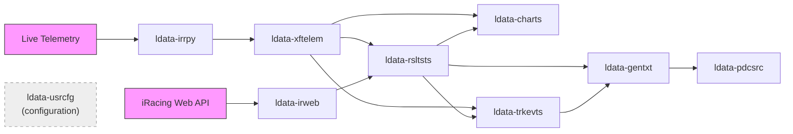

<a href="https://bluefrogracing.com/">
    
</a>

# LEAP Data Catalog

This document provides a comprehensive catalog of the data producers and datasets utilized within the LEAP (Live Event Analysis and Performance) system. Each dataset is described along with its corresponding data producer and dependencies.

> **Source of truth** — This file is the canonical catalog for `irl_stats` datasets.
> A curated copy (catalog + [data samples](samples/)) can be pulled into any
> consuming repo with [`scripts/pull-leap-catalog.sh`](scripts/pull-leap-catalog.sh).

## Quick Reference

| Dataset | Description | Producer | Dependencies |
|---------|-------------|----------|--------------|
| [`ldata-irweb`](#ldata-irweb) | iRacing Web API downloads | `dprdc-irweb` | iRacing data web API |
| [`ldata-irrpy`](#ldata-irrpy) | Raw telemetry from live sessions | `dprdc-irrpy` | Live scraping during race sessions |
| [`ldata-xftelem`](#ldata-xftelem) | Packaged telemetry data | `dprdc-xftelem` | `ldata-irrpy` |
| [`ldata-rsltsts`](#ldata-rsltsts) | Processed results, driver stats, track records | `dprdc-rsltsts` | `ldata-irweb`, `dprdc-xftelem` |
| [`ldata-charts`](#ldata-charts) | Pre-computed visualization data tables | `dprdc-charts` | `ldata-xftelem`, `ldata-rsltsts` |
| [`ldata-trkevts`](#ldata-trkevts) | Track events (overtakes, incidents, pit stops) | `dprdc-trkevts` | `ldata-xftelem`, `ldata-rsltsts` |
| [`ldata-gentxt`](#ldata-gentxt) | AI-generated race summaries and highlights | `dprdc-gentxt` | `ldata-trkevts`, `ldata-rsltsts` |
| [`ldata-pdcsrc`](#ldata-pdcsrc) | Podcast script source text | `dprdc-pdcsrc` | `ldata-gentxt` |
| [`ldata-usrcfg`](#ldata-usrcfg) | League schedules, track display info, team configs | Manual / Admin | — |

## Data Flow



## League IDs

| League ID | Name |
|-----------|------|
| 637 | iFormula League (IFL) |
| 3630 | — |
| 4534 | — |
| 5567 | — |
| 6555 | iFormula League (IFL) |
| 8126 | — |

---

## Datasets (`ldata-*`)

Durable, queryable artefacts produced by `dprdc-*` jobs.

---

### `ldata-irweb`

**Path:** `dist/data/ldata-irweb/`
**Populated by:** `dprdc-irweb`
**Dependencies:** iRacing data web API

Contains downloads from the iRacing data web API, including lap chart data, league rosters, league season sessions, league seasons, and member data by league.

#### Subdirectories

| Directory | Description | File Pattern | Key Fields |
|-----------|-------------|--------------|------------|
| `lapChartData/` | Lap-by-lap race telemetry per session | `{subsession_id}/{split}.json` | `chunk_info[]` with lap times, incidents, positions per driver |
| `leagueRoster/` | League member rosters | `{league_id}.json` | `roster[]`: `cust_id`, `display_name`, `helmet`, `car_number`, `admin` |
| `leagueSeasons/` | Season metadata and scoring rules | `{league_id}.json` | `seasons[]`: `season_id`, `points_system`, `active`, `num_drops` |
| `leagueSeasonSessions/` | Session schedules, weather, winners | `{league_id}/{season_id}.json` | `sessions[]`: track, weather, launch_at, winner info |
| `membersData/` | Driver profiles with ratings & licenses | `{league_id}/{season_id}.json` | `members[]`: `cust_id`, `display_name`, licenses by discipline, `irating` |

---

### `ldata-irrpy`

**Path:** `dist/data/ldata-irrpy/`
**Populated by:** `dprdc-irrpy`
**Dependencies:** Live scraping during race sessions

Contains raw telemetry data captured during live race sessions.

#### Subdirectories

| Directory | Description | File Pattern | Key Fields |
|-----------|-------------|--------------|------------|
| `telemetryScans/` | Live telemetry captures | `{league_id}/{subsession_id}.json` | `drivers[]`: `id`, `laps[]` with telemetry points (`perc`, `percD`, `t`) |
| `telemetrySubsessions/` | Index of captured subsession IDs | `{league_id}.json` | Simple array of subsession ID integers |

---

### `ldata-xftelem`

**Path:** `dist/data/ldata-xftelem/`
**Populated by:** `dprdc-xftelem`
**Dependencies:** `ldata-irrpy`

Contains packaged telemetry data from race events.

---

### `ldata-rsltsts`

**Path:** `dist/data/ldata-rsltsts/`
**Populated by:** `dprdc-rsltsts`
**Dependencies:** `ldata-irweb`, `dprdc-xftelem`

Contains results and derived statistics, including driver session results, league driver stats, league simsession index, simsession results, simsession driver telemetry, single member (driver) metadata, track info directory, and track records.

#### Subdirectories

| Directory | Description | File Pattern | Key Fields |
|-----------|-------------|--------------|------------|
| `driverSessionResults/` | Per-driver results across sessions | `{league_id}/race/{cust_id}.json` | Nested: `{session_id}.{subsession_id}` → position, laps, incidents, pace |
| `simSessionResults/` | Full session result sheets | `{subsession_id}/{split}.json` | `results[]`: position, start_position, fastest_lap_time, incidents |
| `leagueDriverStats/` | Aggregated driver season stats | `{league_id}.json` | Nested: `{season_id}.{cust_id}` → wins, podiums, poles, incidents |
| `leagueSimsessionIndex/` | Index of all sessions per league | `{league_id}.json` | `seasons[].sessions[].simsessions[]` with types (race/qualify/practice) |
| `simsessionDriverTelemetry/` | Per-driver telemetry from sessions | `{subsession_id}/{split}/{cust_id}.json` | `id`, `laps[]` with telemetry points |
| `singleMemberData/` | Individual driver profiles | `{cust_id}.json` | `cust_id`, `display_name`, `helmet`, licenses, `irating` |
| `trackInfoDirectory/` | Track and car mappings per league | `{league_id}.json` | `track_display`, `car_display`, `car_2_track_map` |
| `trackResults/` | Track-specific records and stats | `{league_id}/{season_id}/{track_id}.json` | `best_quali`, `poles`, `race_lap`, `wins`, `podiums` arrays |

---

### `ldata-charts`

**Path:** `dist/data/ldata-charts/`
**Populated by:** `dprdc-charts`
**Dependencies:** `ldata-xftelem`, `ldata-rsltsts`

Contains data tables for visualizations, including best lap cumulative delta, race cumulative delta, pace percent, pace percent vs. ideal lap, and start-finish position.

#### Subdirectories

| Directory | Description | File Pattern | Key Fields |
|-----------|-------------|--------------|------------|
| `cumulativeDeltaBestLapChartData/` | Best-lap delta tracking over race | `{league_id}/{subsession_id}/{split}.json` | Array of driver objects with cumulative time deltas |
| `cumulativeDeltaChartData/` | Race cumulative delta from leader | `{league_id}/{subsession_id}/{split}.json` | Array of driver objects with race position deltas |
| `pacePercentChartData/` | Driver pace percentage metrics | `{league_id}/{subsession_id}/{split}.json` | Array with `name`, `pace` fields |
| `pacePercentVsIdealLapChartData/` | Pace vs. ideal lap comparison | `{league_id}/{subsession_id}/{split}.json` | Array: `name`, `pace`, `ideal`, `possible improvement`, `position` |
| `startFinishChartData/` | Start vs. finish position changes | `{league_id}/{subsession_id}/{split}.json` | Array with start/finish position data |

---

### `ldata-trkevts`

**Path:** `dist/data/ldata-trkevts/`
**Populated by:** `dprdc-trkevts`
**Dependencies:** `ldata-xftelem`, `ldata-rsltsts`

Contains listings of track events from racing sessions, including track finish position notes, on-track incidents, on-track overtakes, on-track pit stops, and raw position changes.

---

### `ldata-gentxt`

**Path:** `dist/data/ldata-gentxt/`
**Populated by:** `dprdc-gentxt`
**Dependencies:** `ldata-trkevts`, `ldata-rsltsts`

Contains text summaries and highlights for multimedia content, including simsession summaries and simsession highlight text.

#### Subdirectories

| Directory | Description | File Pattern | Key Fields |
|-----------|-------------|--------------|------------|
| `simsessionSummary/` | Narrative race summaries | `{subsession_id}/{split}.json` | String with dramatized race recap text |
| `simsessionHighlights/` | Timed highlight cue scripts | `{subsession_id}/{split}.json` | Array: `time`, `lookAt` (cust_id), `note[]` with descriptions |

---

### `ldata-pdcsrc`

**Path:** `dist/data/ldata-pdcsrc/`
**Populated by:** `dprdc-pdcsrc`
**Dependencies:** `ldata-gentxt`

Contains podcast script source text used to generate news articles and highlight reels.

---

### `ldata-usrcfg`

**Path:** `dist/data/ldata-usrcfg/`
**Source:** Manual / admin configuration

League configuration, scheduling, and display settings.

#### Files

| File | Description | Key Fields |
|------|-------------|------------|
| `activeLeagueSchedule.json` | League schedules with journalist style config | `leagues[]`: `league_id`, `name`, `seasons[]` with `events[]` |
| `trackDisplayInfo.json` | Track ID → display name mapping | `{track_id}`: `short_display`, `display` |
| `blockedSeasons.json` | Seasons excluded from processing | `{league_season_key}`: boolean, `min_season_id` |
| `leagueTeamsInfo/{league_id}.json` | Team rosters per season | `seasons[]`: `season_id`, `teams[]` with `team_name`, `team_members[]` |

---

## Stream Topics (`sdata-*`)

Real-time event feeds produced by `sprdc-*` components.
A topic is listed here only when its schema is registered and considered stable for consumers.

### `sdata-lvtlm`

- **Description**: Unfiltered live telemetry packets (control inputs, lap deltas, car state) streamed from each driver's workstation during an active session.
- **Produced by**: `sprdc-lvtlm`
- **Schema**: TBD
- **Retention / Partitions**: TBD
- **Planned consumers**:
  - `dprdc-lvtlm` (sink → `ldata-lvtlm`, ETA TBD)
  - `chatb-tracktalk` for live spotter messages (ETA TBD)

---

## For Consuming Repositories

A curated set of data samples and this catalog can be pulled into any consuming codebase:

```bash
# From your consuming repo's root:
curl -fsSL https://raw.githubusercontent.com/arturo-mayorga/irl_stats/main/scripts/pull-leap-catalog.sh | bash
# or clone the script and run:
./scripts/pull-leap-catalog.sh
```

This copies:
- `data-catalog.md` — this file, for schema reference
- `samples/` — one trimmed example from every dataset subdirectory

See [`samples/`](samples/) for the full set of sample files and their README.
